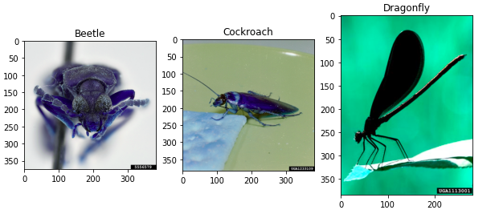

---

layout: post
title: Insects Classification using Deep Learning 
subtitle: Transfer Learning with VGG16
cover-img: /assets/img/network.jpg
image: /assets/img/network.jpg
tags: [Image Detection, VGG16]

---

In this blog, I will show you how to use transfer learning with VGG16 to classify beetles, cockroaches, and dragonflies using this [image data](https://www.insectimages.org/index.cfm). 

👩‍💻 The code and image data can be found [here](https://github.com/Klalena/BIOS823-Statistical_Programming-for-Big-Data/tree/master/Homework/Insect_classification).

# Data 

First, let's look at the data. Here are sample images of three type of insects in the dataset. 



Three classes are relatively balanced, having 1090 images in the training data and 180 images in the test data. 

👩‍💻 For details on data loading and preprocessing, please refer to this [notebook](https://github.com/Klalena/BIOS823-Statistical_Programming-for-Big-Data/blob/master/Homework/Insect_classification/insect_classification.ipynb). 

# VGG16

Transfer learning with VGG16 is used for this problem. What is transfer learning?  [Transfer Learning](https://en.wikipedia.org/wiki/Transfer_learning) means that knowledge gained while solving one problem is leveraged to solve some other related problem. In our case, we will use the VGG16 model,  which is pre-trained on the ImageNet dataset. 

🤔 Let's break it down. 

**VGG16**: It's a convolutional neural network with 16 layers, which was proposed in Oxford paper *Very Deep Convolutional Networks for Large-Scale Image Recognition* and had 93% accuracy in ImageNet. 

Here is how its architecture looks like:


​																	          *Image from Neurohive*

**ImageNet**: Database of around *15* million images with more than 1000 classes. 

**Pre-training**: After a model is trained, the optimized parameters can be used to solve other tasks. Since it takes days or even weeks to train models on such large datasets as ImageNet, using pre-trained models is a convenient and efficient way to tackle similar problems. For example, it took weeks to train VGG16, but we can easily access its pre-trained weights in[ `keras`](https://www.tensorflow.org/api_docs/python/tf/keras).

# Implementation of VGG16 in Python 

Here are the steps to implement VGG16 in Python. 

1️⃣ Define the model 

```python
#import packages 
import tensorflow as tf
from tensorflow.keras.models import Sequential, Model
from tensorflow.keras.applications.vgg16 import VGG16, preprocess_input, decode_predictions
from tensorflow.keras.preprocessing.image import load_img, img_to_array
from tensorflow.keras.layers import Dense, Dropout, Flatten
```

We specified pre-trained weights on the ImageNet dataset and indicated that there are three classes.  

```python
vgg = VGG16(
    input_shape=X_train.shape[1:],
    weights='imagenet', 
    include_top=False,
    classes=3 
)
```

Here we specify that we want to freeze pre-trained weights of the VGG16 model. If you don't have enough data to train on, it is usually sufficient to train the last layer only, which should pick up complex features of your dataset. 

```python
for layer in vgg.layers:
    layer.trainable = False
```

However, if you have enough data,  you can leave the last several layers to be trainable to increase accuracy of your model. For example, you can freeze all but the last layer like this: 

```python
for layer in vgg.layers[:-1]:
    layer.trainable = False
```

The last step is to specify the output layer, which in this case is a Dense layer with three outputs and a `softmax` activation function. 

```python
x = Flatten()(vgg.output)
output = Dense(3, activation='softmax')(x)
vgg_model = Model(inputs=vgg.input, outputs=output)
```

After specifying the model, we need to compile it. 

2️⃣ Compile the model 

Since we have three classes, we will use `sparse_categotical_crossentropy` for our loss function and evaluate the model based on `accuracy`. 

```python
vgg_model.compile(
    optimizer='adam',
    loss='sparse_categorical_crossentropy',
    metrics=['accuracy']
)
```

Now, we are ready to fit the model. 

3️⃣  Fit the model 

```python
vgg_hist = vgg_model.fit(X_train, y_train, batch_size = 64, epochs = 4, validation_split = 0.1)
```

Let's see how the model performed on test data. 

4️⃣ Evaluate the model 

```python
test_loss_vgg, test_acc_vgg = vgg_model.evaluate(X_test, y_test)
```

# Results 

VGG16 model had 92% and 98% accuracy on validation and test data respectively.  I've also tried  the InceptionV3 model, which performed substantially worse than VGG16, resulting in  65% accuracy for both validation and test data. 

Let's check what images the VGG16 model misclassified. There were only four misclassified images: 


# Conclusion 

Having changed only the last layer of our pre-trained model, the model did a great job at classifying beetles, cockroaches, and dragonflies. Thus, transfer learning could be a great way to tackle your problem and you don't need to spend hours or days to train it!


